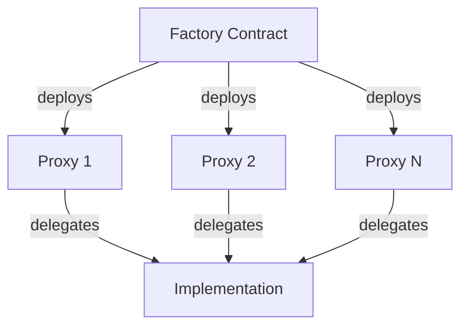

# ERC-1167 Minimal Proxy Standard

## Overview

ERC-1167 is a minimal proxy contract standard that enables deploying many instances of a contract while minimizing gas costs. Instead of deploying the full contract code for each instance, it deploys a small proxy that delegates all calls to a single implementation contract.

## Key Benefits

- **Gas Efficiency**: ~45 bytes of bytecode per proxy vs. full contract deployment
- **Consistency**: All proxies use the same implementation logic
- **Cost Effective**: Ideal for deploying many instances of the same contract
- **Simplicity**: Minimal proxy code reduces complexity and attack surface

## Architecture

### Components

1. **Implementation Contract**
   - Contains the actual business logic
   - Deployed once and reused by all proxies
   - Immutable once deployed

2. **Factory Contract**
   - Manages proxy deployment
   - Creates deterministic clones
   - Tracks deployed proxies

3. **Proxy Contracts**
   - Minimal forwarding contract (~45 bytes)
   - Delegates all calls to implementation
   - Each has unique storage

### Flow Diagram



## Usage Guide

### 1. Deploy Implementation

Deploy the base contract that will serve as the implementation:

```solidity
Logic logic = new Logic();
```

### 2. Deploy Factory

Deploy factory with implementation address:

```solidity
Factory factory = new Factory(address(logic));
```

### 3. Create Clones

Create new proxy instances:

```solidity
address newClone = factory.createClone();
```

### 4. Initialize Clones

Each clone needs initialization:

```solidity
Proxy(newClone).initialize(msg.sender, 100);
```

### 5. Interact with Clones

Interact using the implementation interface:

```solidity
Logic(newClone).setValue(42);
uint256 value = Logic(newClone).getValue();
```

## Deployed Contracts

### Sepolia Network
- Implementation: `0x845B935ab373f8AcB6ffcfe38d0433568Eb23a7A`
- Factory: `0xBE41d8e1bB83eFa6509323a6b4945cad6fFc23cb`
- Initial Clone: `0x6A2E5a42B494a8B9101777Ce82a81E8B46C11F36`

### Base Sepolia
- Implementation: `0x0Dc55753CF0079a74140416CD9A4652Bc886b07D`
- Factory: `0x28Bc153F6F7370b20731B1397C52C4121E36Fc6F`
- Initial Clone: `0xB95Fe2200efA8315Eb99b5486f2f5C0a9Db7dC5C`

### Arbitrum Sepolia
- Implementation: `0x6DAcF04d71807A7637B17C0dAfFF15436c7CB90C`
- Factory: `0xD4BE463d1f9f0e974f3265ED63c793a582b2e123`
- Initial Clone: `0x64538AcD82F3222f5aa9653fbC448a7cCb555773`

## Implementation Details

### Storage Patterns

```solidity
contract Logic {
    bool public initialized;
    address public owner;
    uint256 public value;
    
    function initialize(address _owner) external {
        require(!initialized, "Already initialized");
        initialized = true;
        owner = _owner;
    }
}
```

### Factory Pattern

```solidity
contract Factory {
    address public implementation;
    address[] public clones;
    
    constructor(address _implementation) {
        implementation = _implementation;
    }
    
    function createClone() external returns (address) {
        address clone = Clones.clone(implementation);
        clones.push(clone);
        return clone;
    }
}
```

## Security Considerations

### Initialization Safety
- One-time initialization
- Access control on initialize
- Parameter validation

### Proxy Patterns
- Immutable implementation
- Storage collision prevention
- Delegatecall understanding

### Factory Controls
- Owner-only clone creation
- Clone tracking
- Emergency pause capability

## Upgrade Strategy

While ERC-1167 proxies are not upgradeable themselves, system upgrades can be handled by:

1. **New Implementation**
   - Deploy new implementation
   - Deploy new factory
   - Create new clones

2. **State Migration**
   - Implement migration functions
   - Transfer state if needed
   - Update references

3. **Version Tracking**
   - Track implementation versions
   - Monitor clone versions
   - Manage migrations

## Gas Optimization

### Deployment Costs
- Implementation: ~500k gas
- Factory: ~300k gas
- Each Clone: ~100k gas

### Operation Costs
- Delegate Call: +2.1k gas
- State Changes: Standard gas costs
- Read Operations: Minimal overhead

## Testing

```bash
# Run all tests
forge test

# Run specific test
forge test --match-test testCloneCreation

# Gas report
forge test --gas-report
```

## License

MIT License
